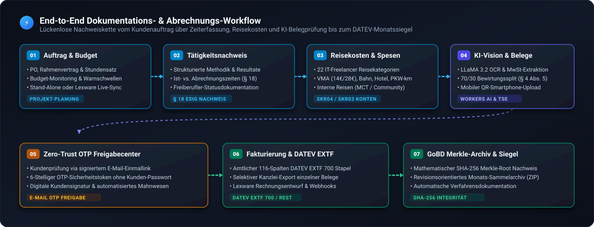

# 💼 ActaNex (ACNX) – Cloud Billing & Evidence Engine

[](LICENSE)
[](docs/procedures/GoBD_Verfahrensdokumentation.md)
[](docs/ARCHITECTURE.md)
[](docs/adr/ADR-004-lexware-office-two-way-sync-and-webhooks.md)

> [!IMPORTANT]
> **Rechtlicher & steuerlicher Disclaimer (GoBD / Steuerrecht):**
> Die Software **ActaNex** und alle darin enthaltenen Module (**ActaChron**, **ActaVault**) stellen ein rein technisches Hilfswerkzeug zur Dokumentation und Rechnungslegungsvorbereitung dar. Es werden keinerlei Garantien, Erfolgszusagen oder steuerliche/rechtliche Beratungsleistungen erbracht. Die vollständige Prüfpflicht vor der Rechnungslegung und steuerlichen Abgabe verbleibt ausnahmslos beim Anwender.

Eine modulare Plattform für freiberufliche Cloud-, Security- und Software-Architekten zur lückenlosen Abwicklung von:
1. **Projekt- & Mandantenverwaltung** mit projektbezogenen Rundungsregeln (`exact`, `15min`, `30min`, `60min`) und Lexware-Office-Synchronisation.
2. **Mobile Zeiterfassung mit ActaChron (PWA)**: 1-Klick Live-Stempeluhr mit automatischem Offline-Sync.
3. **Mobile Beleg-Inbox mit ActaVault (PWA)**: Beleg-Schnellablage im Zwischenspeicher mit KI-Vorerkennung und Confidence-Ampel.
4. **Reisekosten- & Spesenabrechnung**: Etappen-Builder, VMA-Berechnung nach § 9 EStG und DATEV-Kontierung.
5. **Desktop UI Evolution**: Zweigeteiltes linkes Menü und Slide-Over Drawer von rechts mit integrierter Belegvorschau.
6. **GoBD-Audit-Trail & Merkle-Root-Monatssiegeln** mit mathematischem SHA-256 Hash-Nachweis.
7. **Amtlichem DATEV EXTF (Format 700) Export & Lexware Offline-CSV**.



---

## 🌟 Hauptfunktionen im Überblick

### 1. 📊 Executive Controlling & Live-Dashboard
* **Live-KPIs:** Offene abrechenbare Zeiten/Spesen, fakturierter 3-Monats-Umsatz, Forecast der nächsten 3 Monate aus verbleibenden Projektbudgets und aktiver Projektstatus.
* **Projekt-Budget-Tracking:** Fortschrittsbalken mit Warnanzeige bei Budgetüberschreitung.
* **Neueste Leistungsnachweise:** Direkter Absprung zu Freigaben, Rechnungsstatus und PDF-Druck.

### 2. ⏱️ Zeiterfassung & Tätigkeitsnachweise (§ 18 EStG)
* **Strukturierte Tätigkeitsnachweise:** Standardisierte Erfassung von Problemstellung, Methodik, technischer Aktivität und messbarem Resultat zur Unterstützung der Nachweisführung freiberuflicher Tätigkeiten gegenüber dem Finanzamt.
* **Abrechnungstypen:** Billable, NonBillableVisible (Kulanz), NonBillableInternal (Recherche/Orga).

### 3. 🚆 Reisekosten & Spesen (22 Kategorien & SKR04 / SKR03)
* **Spezialisiert auf IT-Freelancer:** 22 praxisnahe Reise- und Nebenkostenkategorien inkl. Messen/Kongresse, Fachkonferenzen, Coworking-Day-Pässe, Auslands-Roaming, Eil-Hardware/Kabel vor Ort, PKW-km (0,30 €/km), Bahntickets, ÖPNV, Hotel (Logis/Frühstück getrennt) und VMA (14 € / 28 €).
* **Multi-Kontenrahmen:** Vollautomatische Vorkontierung wahlweise nach **SKR04** oder **SKR03** sowie Berücksichtigung der Kleinunternehmerregelung gem. § 19 UStG.
* **Interne Non-Client Reisen:** Erfassung von MCT Community-Vorträgen, Meetups und Fortbildungen ohne Kunden-Dummy.

### 4. 🧠 KI-Vision Belegerkennung & Betriebsausgaben (§ 4 Abs. 5 EStG)
* **Cloudflare Workers AI Vision Scanner:** Automatische OCR- und Feldextraktion für Rechnungsbetrag, Vorsteuer (19 % / 7 %), Kreditor/Lokal, Zahlungsart und Trinkgeld per `@cf/meta/llama-3.2-11b-vision-instruct` (sowie Instant-Fallback auf Moondream 3.1 & LLaVA 1.5).
* **Cross-Device Smartphone QR-Upload:** Belege mit dem Smartphone fotografieren und über eine ephemere 15-Minuten-Session in Echtzeit direkt an den Desktop-Arbeitsplatz übertragen.
* **GoBD-Deckblatt & 70/30-Bewirtungssplitter:** Systemische Dokumentationshilfe nach § 4 Abs. 5 EStG / § 12 EStG inklusive SKR04/SKR03-Kontierung (`4650` / `4654`) und SHA-256 Integritätsnachweis.
* **Datenschutz & Meta-Lizenz-Hinweis:**
  * Bei der ersten Nutzung von Meta LLaMA-Modellen in Cloudflare Workers AI kann im Cloudflare Dashboard (*Workers & Pages > AI > Models > LLaMA*) eine einmalige Zustimmung zur Meta Community License erforderlich sein (alternativ stehen mit *Moondream* und *LLaVA* lizenzfreie Sofort-Modelle zur Verfügung).
  * Die KI-Inferenz lässt sich unter *⚙️ Konfiguration & Steuersätze* jederzeit mit einem Klick vollständig deaktivieren.

### 5. 🔐 Zero Trust OTP Kundenfreigabecenter
* **Kein Passwort-Zwang für Kunden:** Der Kunde öffnet einen signierten Deeplink und fordert einen 6-stelligen OTP-Code an, der via Resend an seine E-Mail gesendet wird (15 Min. TTL).
* **Admin-Vorschau & Steuerung:** 1-Klick-Testmodus für Admins, Link-Kopieren und Erinnerungsversand.
* **Korrektur-Workflow:** Kunden können Nachweise beanstanden; der Freelancer erhält sofort eine Benachrichtigung.

### 6. ⚡ Flexible Buchhaltungs-Anbindung: Lexware Live-API & Stand-Alone
* **Lexware Office Live-API:** Automatische Rechnungsentwürfe, 1-Klick Firmenstammdaten-Import, Echtzeit-Webhooks & Storno-Erkennung.
* **Stand-Alone Modus:** Nutzung ohne Buchhaltungs-Cloud mit manueller Erfassung externer Rechnungsnummern (z. B. aus Word, SevDesk, FastBill) und direktem Kanzlei-Export.

### 7. 🔒 Revisionssicherheit & GoBD-Monatssiegel
* **Unveränderbarkeit:** Festgeschriebene Nachweise können nicht manipuliert werden.
* **SHA-256 Merkle-Root-Siegel:** Monatliche mathematische Versiegelung aller Audit-Events.

### 8. 💾 Backup, DATEV EXTF (Format 700), Selektiver Export & Disaster Recovery
* **Offizieller DATEV EXTF Buchungsstapel (Format 700):** Vollständiger 116-Spalten Kanzlei-Export (Kategorie 21) für Steuerberater mit Erlösen (4400/8400 bzw. 4185/8195) und Reiseaufwänden.
* **Selektiver Steuerberater-Export:** Gezielter Export markierter Einzelbelege via Master-Checkbox („Alle / Keine“) für CSV, DATEV und ZIP.
* **Lexware Offline-CSV:** Stapel-Import für Einnahmen und Belege.
* **PDF-Sammelarchiv (ZIP):** Alle Kunden-Leistungsnachweise gefiltert nach Kunde, Projekt, Jahr oder Monat herunterladen.
* **Steuer- & Reisebelege (ZIP):** Alle Originalquittungen und unterschriebenen Dokumente aus R2 gebündelt im ZIP.
* **1-Klick SQL-Dump:** Kompletter SQLite D1 Datenbank-Snapshot zur Wiederherstellung.

---

## 🏗️ System-Architektur: 0,00 € / Monat

Die gesamte Plattform läuft dauerhaft im **kostenlosen Kontingent von Cloudflare**:

```
┌────────────────────────────────────────────────────────────────────────────┐
│                        CLOUDFLARE SERVERLESS EDGE                          │
│                                                                            │
│  • Cloudflare Pages: Blitzschnelle Single Page App (Pure Vanilla JS)       │
│  • Cloudflare Workers: REST API, Event Dispatcher & Lexware Webhooks       │
│  • Cloudflare D1: Relationale SQLite3 Datenbank (ACID-transaktional)       │
│  • Cloudflare R2: S3-kompatibler Objektspeicher für PDFs & Belege          │
│  • Cloudflare Zero Trust: OTP-Verifizierung ohne Kundenseitiges Passwort   │
└────────────────────────────────────────────────────────────────────────────┘
                                     │
            ┌────────────────────────┴────────────────────────┐
            ▼                                                 ▼
┌───────────────────────┐                         ┌───────────────────────┐
│   Lexware Office XL   │                         │  Resend E-Mail Engine │
│  (Rechnungen & Sync)  │                         │   (OTP Freigabecodes) │
└───────────────────────┘                         └───────────────────────┘
```

Ausführliche technische Details finden Sie in **[`docs/ARCHITECTURE.md`](docs/ARCHITECTURE.md)** sowie den **[Architecture Decision Records (ADRs)](docs/adr/)**.

---

---

## 🚀 Schnelleinstieg & Betrieb

### Option 1 (Empfohlen für Einsteiger): 🚀 1-Klick Setup via GitHub Actions (Zero-Code / Kein Terminal)
> **Ideal für alle Freiberufler:** Sie müssen weder Node.js noch Git lokal installieren. Das gesamte Setup läuft zu 100 % browserbasiert in unter 3 Minuten.

1. **Repository forken** (oben rechts auf *„Fork“* klicken).
2. **2 Secrets eintragen** unter *Settings > Secrets and variables > Actions*:
   * `CLOUDFLARE_ACCOUNT_ID` (aus dem Cloudflare Dashboard)
   * `CLOUDFLARE_API_TOKEN` (minimal berechtigter Token)
3. **Workflow starten:** Unter *Actions* den Workflow **`🚀 Cloudflare & GitHub 1-Click Infrastructure Bootstrapper`** auswählen und auf **`Run workflow`** klicken.
4. **Fertig!** Nach ~90 Sekunden ist Ihre Web-App unter `https://evidence-hub-web.pages.dev` mit D1-Datenbank und R2-Speicher live.

👉 Eine detaillierte Klick-für-Klick Anleitung mit Screenshots finden Sie im **[`docs/procedures/Zero_Code_1_Klick_Cloudflare_Setup.md`](docs/procedures/Zero_Code_1_Klick_Cloudflare_Setup.md)**.

---

### Option 2: Lokales CLI-Deployment (Für Entwickler & Power-User)
1. **Repository klonen & Node.js LTS installieren:**
   ```powershell
   winget install OpenJS.NodeJS.LTS --accept-package-agreements --accept-source-agreements
   ```
2. **Mit Cloudflare verknüpfen:**
   ```powershell
   npx wrangler login
   ```
3. **Backend & Frontend ausrollen:**
   ```powershell
   cd src/Worker && npx wrangler deploy
   cd ../Web && npx wrangler pages deploy . --project-name=evidence-hub-web
   ```

---

### Option 3: 100 % Autarker Lokaler Betrieb mit Docker Desktop (Ohne Cloudflare)
1. **Docker Desktop starten.**
2. **PowerShell-Starter ausführen:**
   ```powershell
   .\start-local-docker.ps1
   ```
3. **Fertig!** Die Web-App öffnet sich automatisch unter `http://localhost:8080` mit lokaler SQLite-Datenbank.

---

### 🔑 Erstanmeldung & Sicherheit
* **Standard-Start-Zugangsdaten:** `admin@example.com` / `Start123!`
* **Ersteinrichtungs-Assistent:** Beim ersten Login mit den Standardwerten fordert Sie das System automatisch auf, Ihren **Namen**, Ihre **persönliche E-Mail** und ein **individuelles sicheres Passwort** zu vergeben.
* **Profilverwaltung:** Name, E-Mail und Passwort können später jederzeit im Menü *⚙️ Einstellungen > 8. Administrator-Zugangsdaten & Profil ändern* angepasst werden.

### 💡 Empfehlung: Eigenes privates Repository für nahtlose Updates (Best Practice)

> [!TIP]
> **Wartung & Zukunftsfähigkeit:**  
> Erstellen Sie für Ihren Produktivbetrieb ein **eigenes privates GitHub-Repository** (über *„Use this template“* oder *„Fork“*):
> 
> 1. **Sicherheit:** Ihre persönlichen CI/CD-Secrets (Lexware API-Key, Resend Key, Cloudflare Tokens) bleiben in Ihrem privaten Repository sicher geschützt.
> 2. **Künftige Updates mit 1 Befehl einspielen:**  
>    Wenn neue Versionen, Bugfixes oder gesetzliche Pauschalenanpassungen (z. B. neue Reisekosten-/VMA-Sätze) veröffentlicht werden, können Sie diese mit zwei Befehlen in Ihr privates Repo mergen:
>    ```powershell
>    git remote add upstream https://github.com/GITHUB_USERNAME/open-evidence-billing-hub.git
>    git fetch upstream
>    git merge upstream/main
>    ```
>    So profitieren Sie dauerhaft von Neuerungen, ohne Ihre eigenen Einstellungen oder Daten zu verlieren.

Eine vollständige Anleitung für Einsteiger finden Sie im **[`DISASTER_RECOVERY.md`](DISASTER_RECOVERY.md)**.

---

## 📚 Dokumentations-Übersicht

| Dokument | Beschreibung |
| :--- | :--- |
| **[`docs/procedures/Zero_Code_1_Klick_Cloudflare_Setup.md`](docs/procedures/Zero_Code_1_Klick_Cloudflare_Setup.md)** | **1-Klick Setup-Leitfaden:** Zero-Code Deployment via GitHub Actions in unter 3 Min. |
| **[`docs/procedures/System_Verification_and_Compliance_Evidence_Report.md`](docs/procedures/System_Verification_and_Compliance_Evidence_Report.md)** | **Compliance & Abnahmenachweis:** GoBD-, DSGVO- & Secrets-Audit-Report für Prüfer |
| **[`docs/ARCHITECTURE.md`](docs/ARCHITECTURE.md)** | Vollständige System-, Schichten- und Sicherheitsarchitektur mit Mermaid-Diagrammen |
| **[`docs/SECURITY.md`](docs/SECURITY.md)** • **[`PDF-Prüfbericht`](<docs/procedures/Security%20Audit%20%26%20Verification%20Report%20-%20Freelancer%20Evidence%20%26%20Billing%20Hub.pdf>)** | Offizieller Security Audit Report (OWASP Top 10 A+, BSI TR-02102) mit kryptografischem SHA-256 Siegel |
| **[`docs/adr/`](docs/adr/)** | Architecture Decision Records (D1 SQLite, OTP, Merkle Trees, Webhooks, DATEV EXTF, 1-Click Bootstrapper) |
| **[`DISASTER_RECOVERY.md`](DISASTER_RECOVERY.md)** | Notfall-Wiederherstellungshandbuch für Cloudflare und Docker Desktop |
| **[`docs/procedures/GoBD_Verfahrensdokumentation.md`](docs/procedures/GoBD_Verfahrensdokumentation.md)** | Offizielle GoBD-Verfahrensdokumentation für Betriebsprüfer und Finanzamt |
| **[`docs/procedures/SKR04_Kontenrahmen_und_Buchungsleitfaden.md`](docs/procedures/SKR04_Kontenrahmen_und_Buchungsleitfaden.md)** | Buchungsleitfaden für Reisekosten, Verpflegung und DATEV-Kontierung |
| **[`docs/procedures/Update_und_Staging_Strategie.md`](docs/procedures/Update_und_Staging_Strategie.md)** | Update-, Staging- & Branching-Leitfaden für Nicht-Entwickler und DEV-Power-User |
| **[`docs/procedures/Fehlerbehebung_und_Support_Diagnose.md`](docs/procedures/Fehlerbehebung_und_Support_Diagnose.md)** | Fehlerbehebungs-Leitfaden, 1-Klick Support-Diagnose & Cloudflare/Docker Logfile-Analyse |

---

## ⚖️ Lizenz & Rechtlicher Hinweis

Dieses Projekt ist unter der **MIT-Lizenz** lizenziert (siehe [`LICENSE`](LICENSE)).  
Copyright (c) 2026 Michael Kirst-Neshva.

### 📌 Wichtiger Hinweis zur steuerlichen Ordnungsmäßigkeit (GoBD):
* **Konzeption & Zielsetzung:** Die Software und die beiliegenden Vorlagen wurden nach bestem Wissen und Gewissen auf Basis praktischer IT-Architektur-Erfahrung und unter Zuhilfenahme moderner KI-gestützter Entwicklungswerkzeuge konzipiert, um Freiberufler bei der Erfüllung der Anforderungen der Grundsätze zur ordnungsmäßigen Führung und Aufbewahrung von Büchern, Aufzeichnungen und Unterlagen in elektronischer Form (**GoBD**) sowie **§ 18 EStG** technisch und organisatorisch bestmöglich zu unterstützen.
* **Keine Steuer- oder Rechtsberatung:** Diese Software, Vorlagen und Muster-Dokumentationen stellen **keine Rechts- oder Steuerberatung** dar und begründen keine rechtlich bindende Eigenschaftszusicherung oder Garantie auf GoBD-Konformität.
* **Verantwortung des Steuerpflichtigen:** Nach den Vorgaben der Finanzverwaltung (BMF) hängt die GoBD-Konformität stets von den individuellen betrieblichen Abläufen und der ordnungsgemäßen Umsetzung der Verfahrensdokumentation durch den jeweiligen Anwender/Unternehmer ab. Bitte stimmen Sie Ihre buchhalterischen Prozesse im Zweifel mit Ihrem Steuerberater ab.

