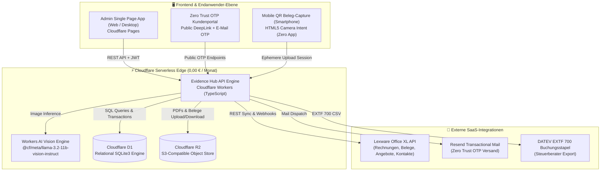
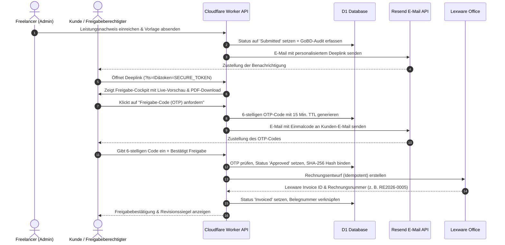

# 🏛️ Freelancer Evidence & Billing Hub - System- & Architektur-Dokumentation

**Version:** 2.8.0 (Enterprise Freelancer Edition)  
**Status:** In Produktion  
**Hostingkosten:** 0,00 € / Monat (Dauerhaft im Cloudflare Free Tier)  
**Compliance:** GoBD-konform, § 18 EStG Tätigkeitsnachweise, § 4 Abs. 5 / § 12 EStG Bewirtungsbelege, DSGVO-konform (EU Data Locality)

---

## 1. 🌐 Gesamtarchitektur & Systemübersicht

Der **Freelancer Evidence & Billing Hub** ist eine serverless betriebene Komplettlösung für freiberufliche Cloud-, Security- und Software-Architekten. Er automatisiert die lückenlose Kette von der täglichen Zeiterfassung über § 18 EStG-qualifizierte Tätigkeitsnachweise, Reisekosten- und operative Belegabrechnung (SKR04/SKR03), KI-Vision-Belegscanner, Smartphone-QR-Erfassung, revisionssichere Zero-Trust-Kundenfreigaben bis hin zur automatischen Rechnungsstellung und Belegsynchronisation in **Lexware Office** und **DATEV EXTF 700**.

---

## 2. 🧩 Schichtenarchitektur (Component Breakdown)

### 2.1 Frontend (Cloudflare Pages SPA & Mobile View)
* **Technologie:** Pure Vanilla HTML5, CSS3, ES2022 JavaScript (keine schweren Frameworks wie React/Angular/Vue $\rightarrow$ Ladezeit < 100ms, kein Build-Overhead, kein Vendor Lock-in).
* **Bibliotheken:**
  * **FontAwesome 6.5:** Enterprise Icons.
  * **JSZip 3.10:** Client-seitige Komprimierung und Bündelung von PDF-Sammelarchiven und Steuerbelegen direkt im Browser des Anwenders.
  * **QRCode.js:** Client-seitige Generierung dynamischer QR-Codes für die Smartphone-Kopplung.
* **Sicherheit:** CSRF-Schutz, XSS-Escaping aller dynamischen Strings, JWT-Session-Token mit automatischem Ablauf.

### 2.2 Backend & API-Engine (Cloudflare Workers & Workers AI)
* **Technologie:** TypeScript / ES Modules, kompiliert auf die V8-Isolates-Runtime von Cloudflare.
* **Routen & Endpunkte:**
  * `/api/v1/dashboard/stats`: Aggregation von 3-Monats-Umsatz, offenen Zeiten/Spesen, Forecast aus Restbudgets.
  * `/api/v1/customers` & `/api/v1/projects`: Mandanten- und Projektverwaltung inkl. kaskadierender Bereinigung.
  * `/api/v1/time-entries` & `/api/v1/trips`: Zeiterfassung, Reisekosten-Planung (Forecast), Mehretappen-Rundreisen und 1-Klick-Überführung (`/api/v1/trips/:id/complete`).
  * `/api/v1/vouchers`: CRUD, 70/30-Aufteilung und GoBD-Hash für operative Belege.
  * `/api/v1/vouchers/scan-ai`: Cloudflare Workers AI Vision Belegextraktion.
  * `/api/v1/vouchers/upload-session/*`: Ephemere Smartphone-Upload-Sessions mit 15 Min. TTL.
  * `/api/v1/timesheets`: Stundenzettel-Lifecycle (Draft $\rightarrow$ Submitted $\rightarrow$ Approved $\rightarrow$ Invoiced $\rightarrow$ Canceled).
  * `/api/v1/public/timesheets/:id/otp/*`: Öffentliche Zero-Trust OTP-Freigabe für Kunden ohne Login.
  * `/api/v1/export/*`: Gefilterte Exporte für Leistungsnachweis-PDFs, DATEV EXTF 700, Originalbelege (ZIP) und SQL-Dumps.
  * `/api/v1/webhooks/lexware`: Bidirektionaler Live-Webhook für Rechnungsstornos, Bezahlstatus und Löschungen in Lexware.

### 2.3 Persistenzschicht (Cloudflare D1 SQLite)
* **Technologie:** Cloudflare D1 (Verteilte SQLite3 Engine mit relationaler Integrität).
* **Kern-Tabellen:**
  * `customers`, `projects`: Stammdaten mit Lexware-ID-Verknüpfung.
  * `time_entries`, `trips`, `trip_legs`, `trip_expenses`, `receipts`: Bewegungsdaten, Teilstrecken/Rundreisen und Belegmetadaten.
  * `operational_vouchers`: Operative Belege, Bewirtung § 4 Abs. 5 EStG, 70/30-Split, Teilnehmerliste, Vorsteuer und SHA-256 Hash.
  * `voucher_upload_sessions`: Temporäre Cross-Device Smartphone-Upload-Sessions.
  * `timesheet_versions`, `approvals`, `billing_batches`: Versionierte Abrechnungsstände und Freigabeprotokolle.
  * `audit_events`, `monthly_archive_seals`: Append-Only GoBD-Audit-Trail und SHA-256 Merkle-Root-Monatsabschlüsse.
  * `app_settings`, `users`, `otp_verifications`: Konfiguration und Sicherheit.

### 2.4 Objektspeicher (Cloudflare R2)
* **Technologie:** AWS S3-kompatibler Cloudflare R2 Bucket (`evidence-hub-documents`).
* **Verwendungszweck:**
  * Ablage von Originalquittungen (Tankbelege, Bahntickets, Bewirtungsbelege).
  * Archivierung der vom Kunden digital signierten Leistungsnachweise.
  * Hinterlegung der Auftragnehmer-Signatur für den PDF-Druck.

---

## 3. 🔐 Zero Trust OTP Freigabe-Workflow

---

## 4. ⚖️ GoBD-Konformität & Revisionssicherheit

1. **Unveränderbarkeit (Immutability):**
   * Sobald ein Leistungsnachweis den Status `Approved` oder `Invoiced` erreicht, werden alle zugehörigen Zeiteinträge und Reisekosten schreibgeschützt gesperrt.
   * Änderungen erfordern eine explizite Korrekturversion (`version_number + 1`), wobei die Vorgängerversion unverändert im Archiv erhalten bleibt.
2. **Kryptografischer Hash-Nachweis:**
   * Jeder Datensatz wird mit einem SHA-256 Hash (`data_hash_sha256`) und einem PDF-Hash (`pdf_frozen_hash`) versiegelt.
3. **Monatliche Merkle-Root-Siegel:**
   * Über die Funktion *Monat schreibgeschützt versiegeln* wird ein mathematischer SHA-256 Merkle-Root-Hash über alle Audit-Events des Kalendermonats gebildet und unveränderbar in `monthly_archive_seals` abgelegt.
4. **Storno- & Korrektur-Tracking:**
   * Stornierungen in Lexware werden über Webhooks sekundenschnell erkannt, im GoBD-Audit-Trail dokumentiert und die betroffenen Zeiteinträge automatisch für eine Neufakturierung freigegeben.

---

## 5. 🛡️ Datensouveränität & Portabilität

* **Kein Datenbank-Lock-in:** Die Datenbank ist reines SQLite3. Ein Export per SQL-Dump läuft ohne Konvertierung auf jedem Server, Mac oder PC.
* **Kein Speicher-Lock-in:** R2 verwendet die Standard-S3-API. Ein Umzug zu Hetzner, AWS oder MinIO ist per Konfigurationszeile möglich.
* **100 % Autarker Lokaler Betrieb (Docker Desktop):**
  * Mit `docker compose up -d` oder dem Skript `start-local-docker.ps1` läuft der gesamte Hub ohne Cloudflare lokal auf `http://localhost:8080`.

---

## 6. ⚖️ Rechtlicher & Steuerlicher Hinweis (Disclaimer)

* **Keine Steuer- oder Rechtsberatung:** Diese Dokumentation und die Software dienen rein als technisches Hilfsmittel zur Organisation und Vorbereitung von Abrechnungs- und Reisekostenunterlagen. Sie stellen keine steuerliche oder rechtliche Beratung dar.
* **Keine Gewährleistung oder Erfolgsgarantie:** Es wird keinerlei Garantie, Zusicherung oder Haftung für die steuerliche Anerkennung von Reisekosten, Pauschalen, Abzügen oder Vorsteuerbeträgen durch Finanzbehörden übernommen. Die Einhaltung gesetzlicher Pflichten (insb. GoBD, EStG, UStG) obliegt der eigenverantwortlichen Prüfung des Anwenders und dessen steuerlichem Berater.
