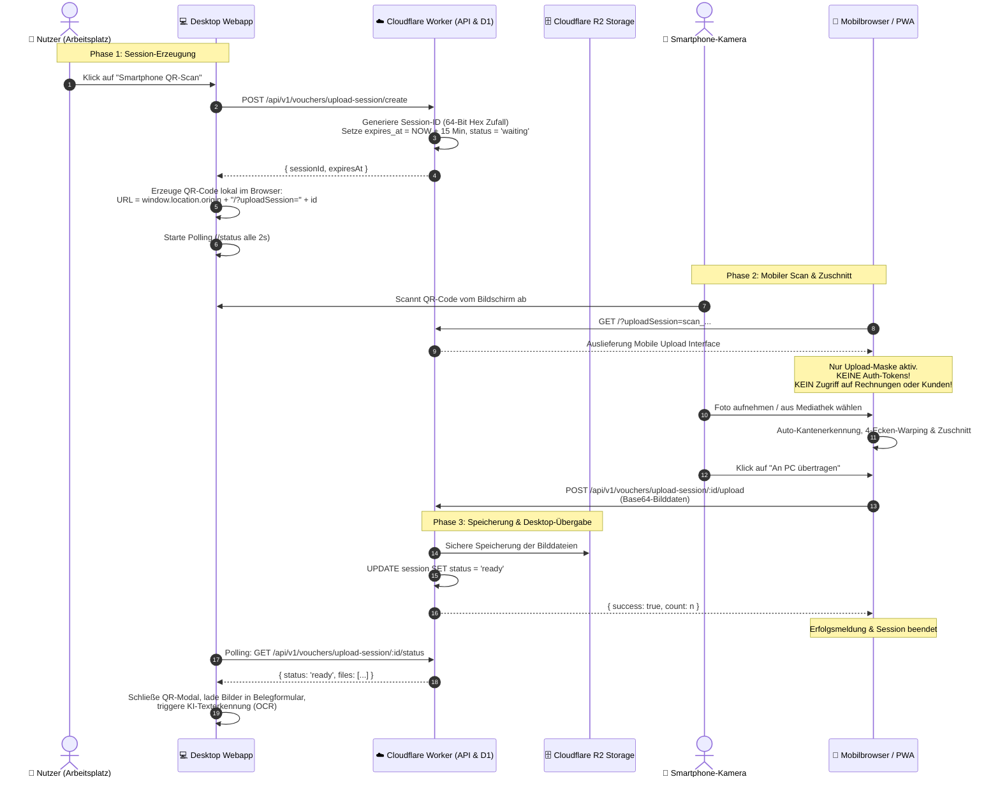
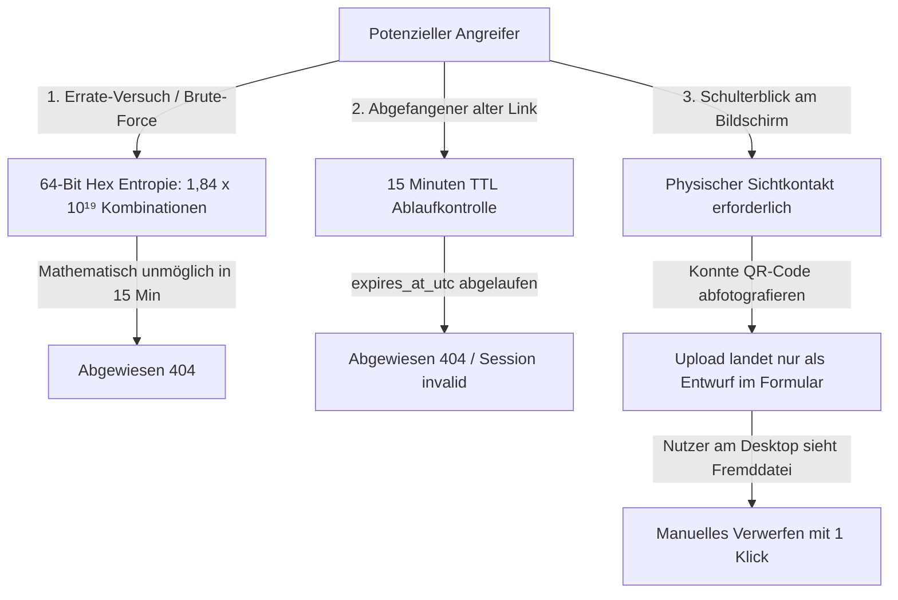
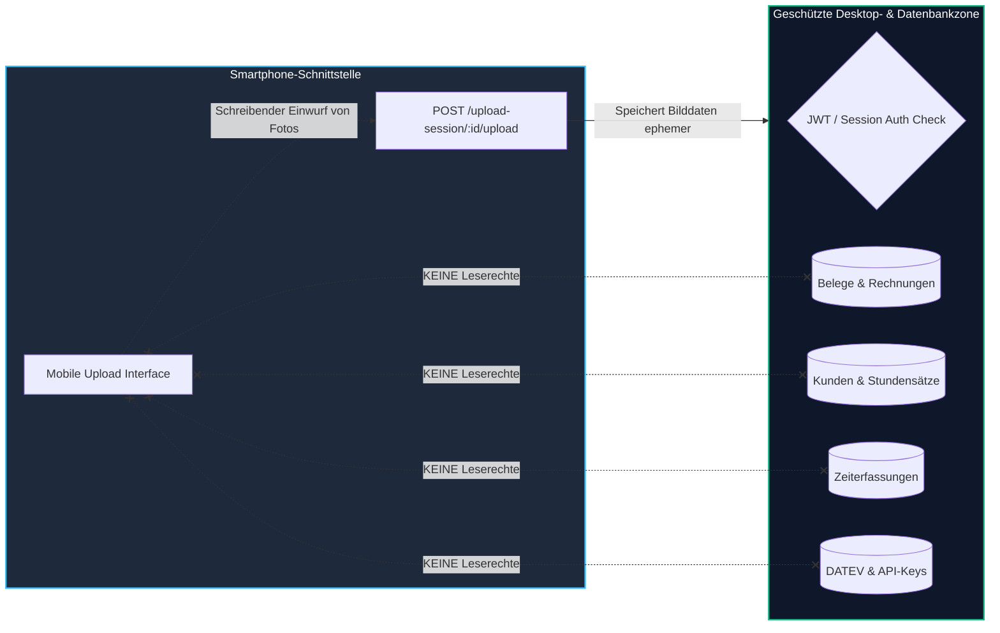

# Sicherheits- & Architekturkonzept: Mobiler Cross-Device Beleg-Upload

**Dokument-Version:** 1.0.0  
**Geltungsbereich:** Cross-Device Smartphone-Belegerfassung (QR-Code & PWA) in den 2.x- und 3.x-Instanzen  
**Prüfgrundlagen:** Stand der Technik (State of the Art), OWASP ASVS (Application Security Verification Standard), Zero-Trust-Architektur, BSI IT-Grundschutz (Bausteine APP und CON)

---

> [!IMPORTANT]
> ### Rechtlicher Hinweis & Haftungsausschluss (Disclaimer)
> Dieses Dokument beschreibt das technische Architektur-, Sicherheits- und Datenflusskonzept nach dem **aktuellen Stand der Technik** zum Zeitpunkt der Erstellung.
> 
> * **Keine Beschaffenheitsgarantie:** Sämtliche Angaben stellen eine technische Beschreibung der implementierten Schutzmaßnahmen dar und begründen **keine rechtliche Garantie, keine Gewährleistung und keine Zusicherung absoluter Sicherheit**. In der Informationstechnik existiert keine hundertprozentige, unfehlbare Sicherheit.
> * **Keine Haftungsübernahme:** Die Autoren und Maintainer übernehmen keine Haftung für Schäden, die aus dem Betrieb, Fehlkonfigurationen, Sicherheitsvorfällen auf Drittsystemen (z. B. kompromittierte Smartphones oder Cloud-Anbieter) oder Missbrauch durch Dritte entstehen.
> * **Geteilte Verantwortung (Shared Responsibility):** Die Wirksamkeit des Konzepts setzt voraus, dass der jeweilige Betreiber die empfohlenen operativen Schutzmaßnahmen (insbesondere HTTPS/TLS-Verschlüsselung, Cloudflare-Sicherheitsregeln und physische Bildschirmsicherung) ordnungsgemäß umsetzt.

---

## 1. Ausgangslage & Zielsetzung

Bei der Digitalisierung von Papierbelegen (z. B. Gastronomiebewirtung, Tankstellenquittungen, Taxibelege) an einem Desktop- oder Laptop-Arbeitsplatz besteht klassischerweise ein **Medienbruch**:

* Papierbelege müssen umständlich abfotografiert und per E-Mail, Messengerdienst, Cloud-Drive oder AirDrop an den Computer übertragen werden.
* Das direkte Aufrufen der vollständigen Hauptanwendung auf dem Smartphone ist für kleine Displays überfrachtet, erfordert einen vollwertigen Login und vergrößert die Angriffsfläche bei Verlust des mobilen Endgeräts.

**Lösung:**  
Ein **Cross-Device Ad-hoc Upload-Kanal** mit ephemeren (kurzlebigen) Sessions und eine **abgeschirmte PWA-Inbox (Blind Drop)**. Das Smartphone dient ausschließlich als optischer Scanner, ohne Lese- oder Administrationsrechte für das Buchhaltungssystem zu erhalten.

---

## 2. Visueller Datenfluss & Komponenten-Architektur

Das folgende Diagramm visualisiert den strikt getrennten Kommunikationsfluss zwischen Desktop-Arbeitsplatz, Cloudflare Edge Worker (API & Storage) und dem Smartphone:



---

## 3. Detaillierte Sicherheitsanalyse nach Risikobereichen

### 3.1 Instanz-Isolation: Eigene Instanz vs. Produktivsystem (Frage a)

* **Bedrohung:** Ein Nutzer scannt einen QR-Code, wird aber versehentlich auf eine fremde Instanz, eine zentrale Prod-Umgebung oder eine Test-Instanz geleitet.
* **Schutzmechanismus:**
  * **Dynamische Origin-Auflösung:** Die URL im QR-Code wird im Browser zur Laufzeit aus der JavaScript-Eigenschaft `window.location.origin` abgeleitet:
    ```javascript
    const mobileUrl = `${window.location.origin}/?uploadSession=${activeMobileScanSessionId}`;
    ```
  * **Wirkung:** Das Smartphone wird exakt auf die Domain/Subdomain gelotst, von der aus der Desktop-Nutzer den Hub betreibt (z. B. `https://mein-hub.pages.dev` oder `http://localhost:8787`).
  * **PWA-Isolierung:** Auch eine installierte PWA ist fest an die Domain gebunden, von der sie installiert wurde. Cross-Domain-Übertragungen sind durch die Same-Origin-Policy (SOP) moderner Browser nativ gesperrt.

---

### 3.2 Schutz vor Link-Diebstahl, Brute-Force & Spam-Dokumenten (Frage b)

* **Bedrohung:** Ein Dritter fängt den Link ab oder errät die Session-ID, um die Instanz mit unerwünschten Dateien zu fluten (Spam/Denial-of-Storage).
* **Schutzmechanismen:**



1. **Kryptografische Unvorhersehbarkeit (Entropie):**  
   Die Session-ID wird serverseitig über einen kryptografisch sicheren Zufallsgenerator erzeugt:
   $$\text{ID} = \text{"scan\_"} + \texttt{crypto.randomUUID().replace(/-/g, "").substring(0, 16)}$$
   Dies entspricht **64 Bit echter Hex-Entropie** ($2^{64} \approx 1,84 \times 10^{19}$ Zustände). Ein systematisches Durchprobieren (Brute-Force) über das Netzwerk innerhalb des kurzen Zeitfensters ist mathematisch ausgeschlossen.
2. **Strikte zeitliche Begrenzung (Time-To-Live, 15 Minuten):**  
   Jede Session erhält bei der Erstellung einen Ablaufzeitstempel (`expires_at_utc = NOW() + 15 Minuten`). Nach Ablauf dieses Fensters verfällt die Session unwiderruflich.
3. **Physischer Sichtkontakt (Zero-Broadcast):**  
   Der QR-Code wird nicht per E-Mail versendet oder im Netzwerk publiziert. Er ist ausschließlich lokal auf dem Monitor des angemeldeten Benutzers sichtbar. Ein Diebstahl erfordert physische Anwesenheit im Raum ("Shoulder Surfing").
4. **Schadensbegrenzung im Worst-Case ("Schulterblick"):**  
   Sollte ein Angreifer im Büro den QR-Code tatsächlich unbemerkt vom Bildschirm abfotografieren, kann er maximal Bilddateien in diese eine konkrete Erfassungsmaske einbringen. Da der authentifizierte Benutzer am Desktop das Formular vor der GoBD-Abspeicherung final prüft, wird ein fremdes Bild sofort bemerkt und mit einem Klick gelöscht. Es erfolgt **keine automatische Buchung**.

---

### 3.3 Vertraulichkeit: Schutz vor Einsicht und Manipulation bestehender Daten (Frage c)

* **Bedrohung:** Ein Angreifer gelangt in den Besitz der mobilen URL und versucht darüber bestehende Belege, Mandantendaten, Stundensätze oder Zeiterfassungen auszulesen oder zu manipulieren.
* **Schutzmechanismus: Das Prinzip der Einwurfklappe (Blind-Drop Architecture)**



1. **Vollständiges Fehlen von Authentifizierungs-Tokens am Smartphone:**  
   Die mobile URL `/?uploadSession=scan_...` transportiert **weder Cookies noch JWT-Bearer-Tokens noch Lexware-API-Schlüssel**. Das mobile Endgerät ist zu keinem Zeitpunkt im Besitz von Benutzeranmeldedaten.
2. **Reiner Write-Only-Endpunkt:**  
   Die API stellt für diese Session ausschließlich eine Empfangsroute bereit:
   $$\text{POST } \texttt{/api/v1/vouchers/upload-session/:sessionId/upload}$$
   Diese Route verarbeitet eingehende Bilddaten und quittiert den Empfang lediglich mit einem Zähler (`{ success: true, count: n }`). Sie liefert unter keinen Umständen Daten aus dem Datenbestand zurück.
3. **Zentraler Authentifizierungswall für sensible Daten:**  
   Alle Endpunkte für bestehende Daten (`/api/v1/vouchers/list`, `/api/v1/customers`, `/api/v1/time-entries`, `/api/v1/settings`) verlangen ein gültiges Benutzer-Token. Jeder unberechtigte Aufruf wird vom Cloudflare Worker sofort mit HTTP `401 Unauthorized` abgewiesen.
4. **Zero-Footprint auf dem Mobilgerät:**  
   * Es werden keine Belegdaten, Datenbankabzüge oder Finanzdaten im `localStorage`, `sessionStorage` oder `IndexedDB` des Smartphones abgelegt.
   * Sämtliche Bildverarbeitungen (Zuschnitt, Entzerrung) laufen im flüchtigen Arbeitsspeicher (`HTMLCanvasElement`). Beim Schließen des Browser-Tabs werden alle Daten rückstandslos aus dem RAM des mobilen Endgeräts entfernt.

---

## 4. Übersicht: Bedrohungsmatrix & Gegenmaßnahmen

| Bedrohung / Angriffsszenario | Wahrscheinlichkeit | Schadenspotenzial | Technische Gegenmaßnahme im Hub |
| :--- | :---: | :---: | :--- |
| **Erraten von Session-URLs (Brute-Force)** | Nahezu Null | Gering | 64-Bit kryptografische Entropie (`crypto.randomUUID()`) und 15 Min. TTL. |
| **Auslesen von Unternehmensdaten über Smartphone** | Nicht möglich | Kritisch | **Blind-Drop-Architektur**: Smartphone besitzt kein Auth-Token; Endpunkte sind Write-Only. |
| **Verbindungsaufbau zu falschem Server / Prod** | Ausgeschlossen | Mittel | Dynamische Bindung an `window.location.origin` des Desktop-Clients. |
| **Man-in-the-Middle (Abfangen der Bilder)** | Sehr Niedrig | Hoch | Erzwungene Transportverschlüsselung via TLS 1.3 / HTTPS mit HSTS. |
| **Schulterblick im Büro ("Shoulder Surfing")** | Niedrig | Sehr Gering | QR-Code ist nur kurz sichtbar; hochgeladene Fremdbilder werden am Desktop vor Speicherung bemerkt und verworfen. |
| **Datenverbleib auf verlorenem Smartphone** | Nicht möglich | Hoch | Flüchtige Verarbeitung im RAM; keine Speicherung in Browser-Caches. |

---

## 5. Empfehlungen für den Betreiber (Shared Responsibility)

Um das beschriebene Sicherheitsniveau in der Praxis aufrechtzuerhalten, wird Betreibern der Instanzen Folgendes empfohlen:

1. **Ausschließliche Nutzung über HTTPS:**  
   Instanzen sollten im Produktivbetrieb immer mit aktiver SSL/TLS-Verschlüsselung (z. B. via Cloudflare Universal SSL mit „Full (Strict)“) betrieben werden.
2. **Arbeitsplatzsicherung:**  
   Bei Verlassen des Arbeitsplatzes sollte der Desktop-Bildschirm gesperrt werden (`Windows-Taste + L` bzw. `Cmd + Ctrl + Q`), um unbefugtes Scannen offener QR-Codes zu verhindern.
3. **Cloudflare WAF & Rate Limiting:**  
   Zur Abwehr automatisierter Abfragen auf API-Routen empfiehlt sich die Aktivierung der standardmäßigen Cloudflare Bot-Fight-Regeln und Rate-Limits.

---

## 6. Fazit

Das vorliegende Konzept verbindet **maximale Nutzerfreundlichkeit (keine App-Installation, sekundenschneller Belegtransfer)** mit einem **robusten, dem aktuellen Stand der Technik entsprechenden Schutzkonzept**. Durch die konsequente Entkopplung von Upload-Kanal und Datenzugriff bleibt die Vertraulichkeit und Integrität der Finanz- und Mandantendaten auch bei Nutzung mobiler Fremd- oder Privatgeräte vollständig gewahrt.
