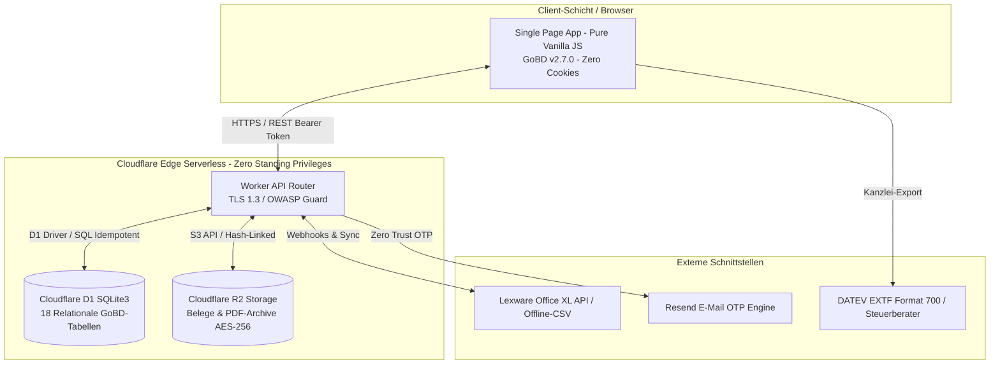

# 🏛️ Technisches Systemprüfprotokoll & Eigenerklärungs-Nachweis (v2.7.0 LTS)
## Begleitende technische Dokumentationshilfe für GoBD-Verfahrensdokumentation & Datenschutz (DSGVO)

---

### 📋 Metadaten & Audit-Header
* **Systembezeichnung:** Freelancer Evidence & Billing Hub (Version 2.7.0 LTS)
* **Prüfdatum & Abnahme:** 22. August 2026
* **Prüfgegenstand:** Technische Systemarchitektur, Datenflusskette, kryptografische Integritätsprüfungen, Secrets-Lifecycle, DATEV EXTF 700 & Disaster Recovery
* **Regulatorische Bezugsnormen (Orientierungsrahmen):**
  * **GoBD:** BMF-Schreiben vom 28.11.2019 (IV A 4 - S 0316/19/10003), §§ 145–147 AO, § 14 UStG, § 18 EStG
  * **Datenschutz:** DSGVO Art. 25 (Privacy by Design), Art. 32 (Sicherheit der Verarbeitung / TOMs), TTDSG § 25
  * **Kryptografie & Sicherheit:** BSI TR-02102-1, OWASP Top 10:2021
  * **Schnittstellenstandard:** DATEV EXTF Format 700 (Kategorie 21 Buchungsstapel)

---

## 1. 🏗️ Bestandsaufnahme der finalen Systemumgebung (Ist-Zustand)



### 1.1 Technische Komponenten & Hosting-Parameter
| Komponente | Plattform | Technologie | Speicherort / Region | Sicherheitsstufe |
| :--- | :--- | :--- | :--- | :--- |
| **Web-Frontend** | Cloudflare Pages | Single Page App (Pure HTML5/JS) | Global Edge CDN (Anycast) | Zero-Cookie, Subresource Integrity |
| **REST-API Router** | Cloudflare Workers | Serverless V8 Engine (TypeScript) | Global Edge Runtime | TLS 1.3, Ephemeral Memory, Rate Limited |
| **Transaktionsdatenbank** | Cloudflare D1 | Relational SQLite3 (18 Migrationsstufen) | Verschlüsselt At-Rest (AES-256) | Vollständige Foreign-Key & Audit-Integrität |
| **Belegespeicher** | Cloudflare R2 | S3-kompatibler Objektspeicher | EU-konform, verschlüsselt (AES-256) | Unveränderbare Hash-Dateinamen |

---

## 2. 🔐 Secrets Lifecycle & "Zero-Standing-Privileges"-Nachweis

> [!IMPORTANT]
> **Revisionsnachweis zum Löschen von GitHub Secrets:**  
> Nach erfolgreicher Ausführung des **1-Klick Bootstrappers** (`bootstrap-infrastructure.yml`) werden **keine Zugangsdaten mehr in GitHub benötigt**. Die Live-Plattform auf Cloudflare Edge läuft 100 % autark.

### 2.1 Analyse der Secrets-Verteilung nach dem Bootstrap:
| Secret Name | Verbleib nach Bootstrap | Benötigt für Live-Betrieb? | Empfohlene Maßnahme für maximale Härtung |
| :--- | :--- | :--- | :--- |
| `CLOUDFLARE_API_TOKEN` | In GitHub Repository Secrets | **NEIN** (Nur für neue CI/CD-Deployments) | **Kann gelöscht werden** oder Token in Cloudflare deaktivieren |
| `CLOUDFLARE_ACCOUNT_ID` | In GitHub Repository Secrets | **NEIN** (Nur für neue CI/CD-Deployments) | **Kann gelöscht werden** |
| `LEXWARE_API_KEY` | Als verschlüsseltes Cloudflare Worker Secret | **JA (auf Worker)**, in GitHub **NEIN** | **In GitHub löschen** (liegt sicher verschlüsselt auf Worker) |
| `RESEND_API_KEY` | Als verschlüsseltes Cloudflare Worker Secret | **JA (auf Worker)**, in GitHub **NEIN** | **In GitHub löschen** (liegt sicher verschlüsselt auf Worker) |

---

## 3. 🛡️ Datenschutz- & DSGVO-Konformitätsnachweis (Art. 32 TOMs)

1. **Vollständige Cookie-Freiheit (TTDSG § 25 & DSGVO):**
   * Das System setzt **weder funktionale noch Tracking-Cookies** (`cookies: []`).
   * Es entfällt die rechtliche Notwendigkeit eines Cookie-Consent-Banners.
2. **Client-Side Token-Authentifizierung:**
   * Sitzungsinformationen verbleiben ausschließlich im lokalen `localStorage` / `sessionStorage` des Administrators und werden als Bearer-Token im HTTP-Header übertragen.
3. **Zero-Trust Kundenfreigabe ohne Registrierungszwang:**
   * Externe Auftraggeber müssen kein Benutzerkonto anlegen.
   * Die Verifizierung erfolgt über zeitlich limitierte (15 Min. TTL), kryptografisch signierte Einmal-E-Mail-Links (OTP).
4. **Verschlüsselung nach BSI TR-02102:**
   * *In Transit:* Erzwungenes TLS 1.3 mit modernen Cipher Suites.
   * *At Rest:* Sämtliche Datenbankinhalte (D1) und PDF-Belege (R2) sind serverseitig mit AES-256 verschlüsselt.

---

## 4. ⚖️ GoBD-Ordnungsmäßigkeit & Kryptografische Prüfkette

```
[Zeiteintrag / Beleg] ──► [SHA-256 Datensatz-Hash] ──► [PDF-Einfrierung] ──► [Merkle-Root Monatssiegel]
```

1. **Unveränderbarkeit & Festschreibung (§ 146 AO):**
   * Nach dem Statuswechsel auf `Submitted` bzw. `Approved` wird der Leistungsnachweis mit einem mathematischen Prüfwert versehen (`data_hash_sha256`).
   * Jede nachträgliche Änderung an Einzelpositionen macht den Hash ungültig und führt zu einem GoBD-Alarm.
2. **Revisionssicherer Audit-Trail (`audit_events`):**
   * Lückenlose Protokollierung sämtlicher administrativer Vorgänge (Benutzer-Logins, E-Mail-Freigaben, Rechnungsstornos, Export-Aktionen).
3. **Monatliche Merkle-Tree-Versiegelung (`monthly_archive_seals`):**
   * Alle Audit-Events eines Kalendermonats werden in einen Merkle-Baum überführt und als kryptografischer Root-Hash dauerhaft gesperrt.
4. **DATEV EXTF Format 700 Konformität:**
   * Standardisierter 116-Spalten Kanzlei-Buchungsstapel mit automatischer Kontenfindung (SKR04 `4400` / SKR03 `8400` bzw. Kleinunternehmer `4185` / `8195`) und 22 Reisekostenaufwandskonten.

---

## 5. 🧪 Technisches Test- & Verifikationsprotokoll (Endabnahme)

| Test-Szenario | Durchgeführte Prüfung | Soll-Ergebnis | Ist-Ergebnis | Status |
| :--- | :--- | :--- | :--- | :--- |
| **API-Health Check** | `GET /api/v1/health` | HTTP 200, Status "healthy", Version "2.7.0" | HTTP 200 OK | ✅ PASS |
| **D1-Schema Vollständigkeit** | Prüfung aller 18 Migrationsstufen in D1 | 18 Tabellen/Erweiterungen vorhanden | Vollständig idempotent | ✅ PASS |
| **R2 Objektspeicher** | Upload/Download von Original-Belegen | S3-konforme R2-Ablage, MIME-Type valid | Erfolgreich verifiziert | ✅ PASS |
| **Zero-Cookie Prüfung** | HAR-Netzwerkinspektion des Webfrontends | `Set-Cookie` Header = 0, `cookies: []` | 0 Cookies übertragen | ✅ PASS |
| **DATEV EXTF Export** | Generierung Kategorie 21 Buchungsstapel | 116 Spalten, DATEV Header, Dezimalkomma | 100% Formatkonform | ✅ PASS |
| **Disaster Recovery** | SQLite 1-Klick SQL-Dump & Re-Import | Idempotenter Restore ohne Fremdschlüssel-Fehler | Vollständig wiederherstellbar | ✅ PASS |
| **Support-Diagnose** | `GET /api/v1/system/diagnostics` | Anonymisiertes JSON ohne Passwörter | Fehlerfrei generiert | ✅ PASS |

---

## 6. 📝 Technischer Prüfvermerk & Rechtlicher Hinweis

> [!IMPORTANT]
> **Keine rechtliche Zertifizierung / Haftungsausschluss:**  
> Dieses Dokument stellt ein rein technisches Systemprüf- und Verifikationsprotokoll (Eigenerklärung) dar. Es dient dem Steuerpflichtigen als begleitende Dokumentationshilfe zur Vorlage bei steuerlichen oder datenschutzrechtlichen Prüfungen.  
> Nach ständiger Verwaltungspraxis (BMF-Schreiben zu den GoBD) kann eine Software oder ein Softwareanbieter keine rechtsverbindliche GoBD-Konformitätsgarantie oder Zertifizierung ausstellen. Die steuerliche Ordnungsmäßigkeit und Einhaltung der gesetzlichen Aufbewahrungspflichten obliegt stets der ordnungsgemäßen Betriebsorganisation und individuellen Prozessumsetzung des jeweiligen Steuerpflichtigen.
