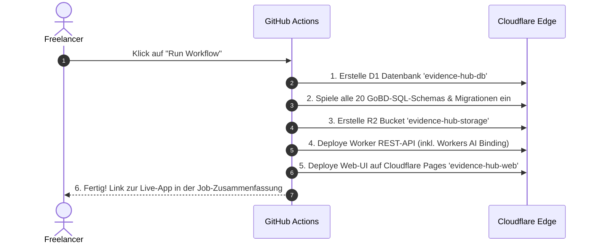

# 🚀 Zero-Code & 1-Klick GitHub Cloudflare Setup-Leitfaden (v2.9.0)

Dieser Leitfaden führt Sie **ohne Terminal, ohne Software-Installation und in unter 3 Minuten** von einem kostenlosen Cloudflare-Konto zur voll funktionsfähigen, GoBD-versiegelten Live-Abrechnungsplattform auf Ihrer eigenen Cloudflare-Domain.

---

## 📋 Voraussetzungen (100 % Kostenlos)
1. **GitHub-Account** (kostenlos auf [github.com](https://github.com)).
2. **Cloudflare-Account** (kostenlos auf [cloudflare.com](https://cloudflare.com)).

---

## 🛠️ Schritt 1: Cloudflare API-Token & Account-ID erstellen (1 Minute)

### 1.1 Account-ID kopieren
1. Melden Sie sich bei [Cloudflare](https://dash.cloudflare.com) an.
2. Klicken Sie links im Menü auf **`Workers & Pages`** ➔ **`Overview`**.
3. Auf der rechten Seite sehen Sie Ihre **`Account ID`**. Kopieren Sie diesen Wert (z. B. `a1b2c3d4e5...`).

### 1.2 API-Token mit Least-Privilege-Rechten erstellen
1. Klicken Sie oben rechts auf Ihr **Profil-Symbol** ➔ **`My Profile`** (Mein Profil).
2. Wählen Sie im linken Menü **`API Tokens`** ➔ **`Create Token`** (Token erstellen).
3. Scrollen Sie ganz nach unten zu **`Custom Token`** und klicken Sie auf **`Get started`**.
4. Vergeben Sie folgende Einstellungen:
   * **Token name:** `Evidence-Hub-Bootstrap`
   * **Permissions (Berechtigungen):** Fügen Sie exakt diese 5 Zeilen hinzu:

| Bereich (Scope) | Ressource | Berechtigung |
| :--- | :--- | :--- |
| **Account** | **D1** | **`Edit`** |
| **Account** | **Workers Scripts** | **`Edit`** |
| **Account** | **Workers R2 Storage** | **`Edit`** |
| **Account** | **Workers AI** | **`Edit`** |
| **Account** | **Cloudflare Pages** | **`Edit`** |
| **User** | **Memberships** | **`Read`** |

5. **Account Resources:** `Include` ➔ `All accounts` (oder Ihren spezifischen Account).
6. Klicken Sie unten auf **`Continue to summary`** ➔ **`Create Token`**.
7. **Wichtig:** Kopieren Sie den angezeigten Token-Code (er wird nur einmal angezeigt!).

---

## 🔐 Schritt 2: GitHub Repository forken & Secrets eintragen (1 Minute)

1. Öffnen Sie das Community-Repository auf GitHub:  
   **[https://github.com/MKN1411/open-evidence-billing-hub](https://github.com/MKN1411/open-evidence-billing-hub)**
2. Klicken Sie oben rechts auf **`Fork`** (oder **`Use this template`**), um Ihre eigene private Kopie in Ihrem GitHub-Account zu erstellen.
3. Gehen Sie in Ihrem neuen Repository auf den Reiter **`Settings`** (Einstellungen).
4. Wählen Sie im linken Menü **`Secrets and variables`** ➔ **`Actions`**.
5. Klicken Sie auf **`New repository secret`** und legen Sie folgende Secrets an:

| Name des Secrets | Wert | Pflicht? |
| :--- | :--- | :--- |
| **`CLOUDFLARE_ACCOUNT_ID`** | Ihre kopierte Cloudflare Account-ID | **Ja** |
| **`CLOUDFLARE_API_TOKEN`** | Ihr kopierter Cloudflare API-Token | **Ja** |
| `LEXWARE_API_KEY` | Ihr Lexware Office XL API-Schlüssel | *Optional* |
| `RESEND_API_KEY` | Ihr Resend API-Schlüssel für OTP-Mails | *Optional* |

---

## ⚡ Schritt 3: 1-Klick Bootstrapper starten (1 Minute)

1. Klicken Sie in Ihrem GitHub-Repository oben auf den Reiter **`Actions`**.
2. Wählen Sie links in der Workflow-Liste den Workflow:  
   **`🚀 Cloudflare & GitHub 1-Click Infrastructure Bootstrapper`**.
3. Klicken Sie rechts auf das Dropdown-Menü **`Run workflow`** ➔ grüner Button **`Run workflow`**.



---

## 🎉 Schritt 4: Fertig! Ihre Web-App ist live

Nach ca. 90 Sekunden ist der Lauf abgeschlossen.
1. Klicken Sie auf den erfolgreichen grünen Lauf.
2. In der **`Summary`** sehen Sie die Direktlinks zu Ihrer fertigen Anwendung:
   * **Web-App URL:** `https://evidence-hub-web.pages.dev`
   * **Initial-Login:** `admin@example.com` / `Start123!`
3. Beim ersten Login öffnet sich automatisch der **Ersteinrichtungs-Assistent**, in dem Sie Ihren Namen, Ihre persönliche E-Mail und Ihr Wunschpasswort vergeben.

---

## 🏛️ Schritt 5: Offiziellen Compliance-Prüfbericht für das Finanzamt abrufen

Direkt nach Abschluss des Bootstrappers startet GitHub Actions vollautomatisch den Workflow **`🔍 Verify Live Environment & Compliance Evidence`**:
1. Er fragt die echten Live-Parameter Ihrer Cloudflare-Instanz (Account-ID, D1-Datenbank UUID, R2 Bucket Status, API Health Status) ab.
2. Er generiert einen individuellen **`COMPLIANCE_EVIDENCE_REPORT.md`** und legt ihn unter den GitHub Actions **Artifacts** zum Download bereit.
3. Sie können dieses Dokument direkt als Anhang zu Ihrer **GoBD-Verfahrensdokumentation** ablegen.

---

## 🛠️ Compliance-Nachweis bei manueller / lokaler Installation erstellen

Falls Sie die Plattform **manuell über das Terminal** oder **lokal mit Docker** betreiben, können Sie den offiziellen Prüfnachweis jederzeit selbst mit einem einfachen PowerShell-Befehl abfragen:

```powershell
# Live-Healthcheck & Diagnose abrufen (ersetzen Sie die URL durch Ihre eigene)
$apiUrl = "https://evidence-hub-worker.your-subdomain.workers.dev" # oder "http://localhost:8080"
$health = Invoke-RestMethod -Uri "$apiUrl/api/v1/health"
$diag   = Invoke-RestMethod -Uri "$apiUrl/api/v1/system/diagnostics"

# Prüfbericht ausgeben
[PSCustomObject]@{
    Pruefdatum_UTC = (Get-Date).ToUniversalTime().ToString("yyyy-MM-ddTHH:mm:ssZ")
    System_Status  = $health.status
    Version        = $health.version
    D1_Kunden      = $diag.database_health.customers
    D1_Projekte    = $diag.database_health.projects
    R2_Speicher    = $diag.environment.has_r2_bucket
} | Format-List
```

---

## 🔄 Künftige Updates einspielen
Sobald neue Releases (z. B. neue gesetzliche Reisekostenpauschalen, Features oder Fehlerbehebungen) erscheinen:
* Bei jedem `git push` auf Ihren `main`-Branch rollt der automatische Workflow **`deploy.yml`** alle Änderungen in Sekundenschnelle ohne Ausfallzeit aus.
